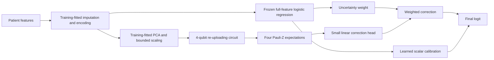
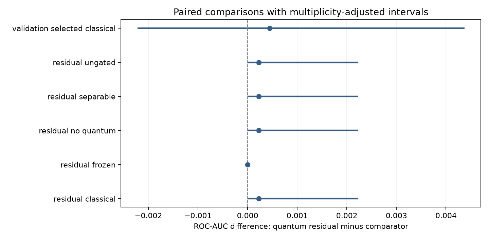

# A quantum residual for uncertain disease classifications

Experiment date: 15 September 2026. **Hypothesis, not a promised advantage.**

We implemented a small quantum correction to a conventional classifier. A classical
model supplies the main prediction; a shallow quantum circuit is allowed to make a
larger correction when that model is uncertain. The experiment asks whether the
correction improves held-out prediction, and whether a classical correction does
the same job. Results below are updated after the locked evaluation completes.

## What the existing project taught us

The previous campaign has 314 completed family/split records, including all 15
WDBC and Cleveland kernel evaluations. It established no robust predictive
advantage. On WDBC, the projected kernel's mean ROC-AUC was 0.9934, but its
balanced accuracy was 0.9548 versus 0.9675 for the full-feature RBF-SVM. The
re-uploading VQC's one completed split was weaker than the classical MLP.
See [the existing evidence](research/QML_MODELS_WITH_BETTER_METRICS.md).

These findings motivate preserving a strong classical prediction while testing a
small nonlinear correction. The old campaign is interrupted and its checkpoints
remain intact; it is not running concurrently with this experiment.

## Three testable improvements

| Candidate | Testable hypothesis | Essential controls | Feasibility and decision |
| --- | --- | --- | --- |
| Trainable quantum embedding kernel | Training input scales and circuit angles by class-balanced kernel-target alignment improves a fixed kernel on validation and then held-out patients. | Frozen kernel; tuned full/PCA RBF-SVM; classically trained embedding with the same output dimension. | Feasible at 4 qubits with small alignment batches, but pairwise optimization adds time and another regularization choice. Proposed, not implemented here. |
| Data-reuploading classifier | Repeated bounded input encoding learns useful nonlinear interactions with fewer qubits than a wide one-pass circuit. | One versus two encoding layers; no entanglement; matched MLP. | Already partly present in the repository. Implemented inside the selected hybrid, with depth tuned only on validation. |
| Uncertainty-gated quantum residual | A quantum correction focused on uncertain classical predictions preserves useful full-feature information and improves discrimination without sacrificing sensitivity. | Calibration alone; no gate; frozen circuit; no entanglement; a classical residual of similar size. | Selected: small batched circuits, no quadratic kernel matrix, and direct tests of the component's contribution. |

Established methods include variational circuits, data re-uploading, residual
connections, uncertainty weighting, classical calibration and validation-based
selection. **Our proposed contribution is their specific combination and controlled
evaluation in this project.** We do not claim to have invented these ingredients,
to be first in the literature, or to have a proven new quantum algorithm.

## Architecture in plain language

First, logistic regression learns from all usable input features. Its coefficients
are frozen. Next, a four-qubit circuit receives four PCA coordinates and learns a
correction. PCA is a compression method fitted on training data; it is not quantum.
A learned scalar and offset can recalibrate the original logit. A logit is the
score before converting to a probability.



For frozen classical logit `b`, define `p = sigmoid(b)` and
`g = 4*p*(1-p) = 1 - tanh(b/2)^2`. The final score is

`score = a*b + c + g*(w · z_theta(x) + d)`.

The gate is largest near `p=0.5` and small near 0 or 1. It is a heuristic based on
the anchor's score, **not a calibrated clinical uncertainty estimate**. An
overconfident wrong anchor can suppress a useful correction. The calibration
parameters `a,c` are trained on training labels along with the correction.
The anchor is one fixed `C=1`, class-balanced logistic fit per seed; it is shared
by every residual/control and does not receive extra hyperparameter search.

## Circuit and data flow

Each of four qubits starts in `|0>`. For each of one or two layers, apply:

1. `RY(s[layer,wire] * x[wire])`: upload the bounded PCA coordinate with a trainable scale.
2. `RZ(theta[layer,wire,0])`, then `RY(theta[layer,wire,1])`: trainable rotations.
3. A nearest-neighbor CNOT chain, `0 -> 1 -> 2 -> 3`.
4. After the final layer, measure the expectation of Pauli Z on each qubit.

Each expectation is a number between -1 and 1, determined by the probabilities of
the qubit's two measurement outcomes. The classical head combines these four
numbers. CNOT gates allow interactions between qubits; the separable control tests
whether those interactions help on this task.

There are `12*layers` one-qubit gates and `3*layers` CNOTs per sample in the
entangled circuit. The circuit has `12*layers` trainable scales/angles, followed
by five head parameters and two calibration parameters: 19 or 31 parameters.
The classical residual has approximately matched capacity (21 or 33 trainable
parameters). Its hidden width is determined from circuit depth before evaluation.
The no-quantum control trains only two calibration parameters. Frozen and
separable controls isolate trainability and entanglement respectively.

Input processing is numeric median imputation plus missing indicators and scaling;
categorical mode imputation and one-hot encoding; training-fitted four-component
PCA, component scaling, and `pi*tanh(component/2)`. Every reduced classical model
receives exactly those same four bounded coordinates. Original-feature models
receive all imputed/encoded predictors. The residual controls all receive the same
anchor logit and reduced coordinates.

Execution uses PennyLane `default.qubit`, exact expectations, Torch autograd and
batched inputs. Four qubits require only 16 complex state amplitudes per sample;
autograd and imported libraries account for much more memory than that state.
This is classical simulation without finite-shot or hardware noise. Gate counts
are analytical circuit counts, not measured device executions or speedup evidence.

## A test set the old campaign did not use

We downloaded [UCI Chronic Kidney Disease](https://archive.ics.uci.edu/dataset/336/chronic+kidney+disease),
400 rows and 24 predictors, directly from its official CSV endpoint. The target is
250 CKD versus 150 non-CKD records. Whitespace/missing-value tokens are normalized,
numeric parsing is strict, and the schema and file checksum are checked. The
dataset contains substantial missingness, including 152 missing red-cell categories.

SHA-256: `0eeea8d17f5ad8792d854999d6ddf1602ec4e116616f6ccdfdaef0ba8109e694`.
Source metadata and download manifest live in `data/raw/uci_ckd_innovation/`.
Dataset DOI: `10.24432/C5G020`. Its UCI page supplies the citation and license.

A fixed stratified group split with master seed 9152026 holds out 80 rows. It is
identical for all models, initialization seeds and configurations. Each of seeds
42, 123 and 2026 divides the remaining 320 rows into 256 training and 64 validation
rows. Identical feature rows are grouped to prevent copies crossing partitions.
The source lacks participant IDs, so grouping cannot establish patient independence
beyond duplicate-feature protection.

Smoke fitting uses only 96 training and 48 validation rows from the development
pool. It never transforms, predicts or scores the held-out test rows. Only after
**every family and seed has a saved validation selection** can the final evaluator
open the test set. The evaluator writes a persistent unsealing marker; a different
experiment cannot silently reuse this cohort as a fresh untouched test. Test labels
are used initially for stratification and later for evaluation, never model fitting,
threshold selection, epoch selection or hyperparameter selection.

The test is untouched within this new local protocol, not a globally secret dataset
or an external clinical cohort. The CKD target is existing disease status and some
laboratory predictors closely reflect diagnosis. No chronology establishes early,
pre-symptomatic or prospective detection.

## Comparable tuning and model selection

The main run has 16 families, 12 candidate configurations per family, and three seeds:
**576 candidate fits**. The five requested baseline families run on both original
and reduced features. Six residual variants share the same neural search grid.

| Family | Fixed search space |
| --- | --- |
| Logistic regression | Six C values from 0.01 to 1000; balanced or unweighted |
| RBF-SVM | C 0.1/1/10/100; gamma `scale`/0.01/0.1 |
| Random forest | Depth unrestricted/4/8; leaf size 1/3; feature fraction sqrt/0.8; 200 trees |
| Gradient boosting | Learning rate 0.03/0.1; 7/15/31 leaves; L2 0/1; 200 iterations |
| Classical MLP and residual variants | 1/2 layers; learning rate 0.003/0.01/0.03; weight decay 0.0001/0.01 |

Neural fits use Adam, batch size 32, weighted binary cross-entropy, gradient clipping,
up to 60 epochs and validation-loss patience 12. The MLP has width 16. Best epoch
uses validation loss; best candidate uses validation ROC-AUC, keeping the first
candidate on a tie. Thresholds maximize validation Youden J. There is no test-driven
grid expansion. Equal candidate counts do not imply equal compute or equal effective
model flexibility: calibration-only has no depth effect, and each residual also
shares the one extra fixed anchor fit. Runtime costs are reported explicitly.

The classical comparator for each seed is selected from all ten classical families
by validation ROC-AUC before opening the test. All individual baseline test scores
are reported too. Neural models are not refitted on validation data before testing.

## Evaluation and uncertainty

We report ROC-AUC, PR-AUC (implemented as **average precision**, not trapezoidal
integration), sensitivity and specificity for every seed and their means. A
stratified paired bootstrap resamples the same test patients for every model and
seed, preserving class counts. Its 95% intervals describe patient-sampling
uncertainty conditional on these fitted models; they do not include all training
sample or model-selection uncertainty. Repeated seeds on one test set are not
independent cohorts.

For the sensitivity/specificity levels, the final report uses conservative exact
binomial intervals rather than a possibly degenerate bootstrap at perfect scores.
Each seed receives a Clopper-Pearson interval with significance level `0.05/3`;
averaging their lower/upper endpoints gives conservative coverage for the mean
rate by the Bonferroni union bound, without requiring seed independence. This
reporting refinement was made while the test was still locked. Paired differences
continue to use the same-patient bootstrap specified above. The source population
and conditional fitted-model assumptions still matter.

Six prespecified ROC-AUC comparisons contrast the proposed residual with the
validation-selected classical comparator and each residual control. We use
Bonferroni-adjusted paired intervals for these differences. Other metric intervals
are descriptive. The predictive signal rule requires ROC-AUC gain at least 0.01,
an adjusted lower bound above zero, and a sensitivity-difference 95% lower bound
at least -0.02. A uniquely quantum contribution additionally needs supporting
classical-replacement, frozen and separable ablations; a win against logistic alone
is insufficient.

One thousand bootstrap draws provide approximate intervals. Extreme adjusted
quantiles have Monte Carlo error, and perfect scores on a small holdout can produce
degenerate intervals. Neither means real-world error is zero. Threshold-dependent
metrics are particularly sensitive to the small validation set.

## Results

<!-- INNOVATION_RESULTS_START -->
Completed **576 candidate fits and 48 held-out family/seed evaluations**, using all 400 rows under the fixed 256/64/80 partitions.

The proposed model's mean ROC-AUC was **0.9984**, versus **0.9980** for the validation-selected classical comparator.
The paired ROC-AUC difference was +0.0004, with multiplicity-adjusted interval [-0.0022, +0.0044]. The prespecified predictive signal rule was not met.

| Approach | ROC-AUC [95% CI] | PR-AUC [95% CI] | Sensitivity [95% CI] | Specificity [95% CI] |
| --- | --- | --- | --- | --- |
| validation_selected_classical | 0.9980 [0.9920, 1.0000] | 0.9988 [0.9955, 1.0000] | 0.9733 [0.8618, 0.9982] | 0.9889 [0.8326, 0.9999] |
| residual_quantum | 0.9984 [0.9931, 1.0000] | 0.9991 [0.9961, 1.0000] | 0.9667 [0.8492, 0.9981] | 1.0000 [0.8525, 1.0000] |
| residual_classical | 0.9982 [0.9924, 1.0000] | 0.9990 [0.9957, 1.0000] | 0.9667 [0.8492, 0.9981] | 1.0000 [0.8525, 1.0000] |
| residual_no_quantum | 0.9982 [0.9924, 1.0000] | 0.9990 [0.9957, 1.0000] | 0.9667 [0.8492, 0.9981] | 1.0000 [0.8525, 1.0000] |
| residual_separable | 0.9982 [0.9924, 1.0000] | 0.9990 [0.9957, 1.0000] | 0.9667 [0.8492, 0.9981] | 1.0000 [0.8525, 1.0000] |
| residual_frozen | 0.9984 [0.9931, 1.0000] | 0.9991 [0.9961, 1.0000] | 0.9667 [0.8492, 0.9981] | 1.0000 [0.8525, 1.0000] |
| residual_ungated | 0.9982 [0.9924, 1.0000] | 0.9990 [0.9957, 1.0000] | 0.9667 [0.8492, 0.9981] | 1.0000 [0.8525, 1.0000] |

Summed candidate tuning time: **34.00 minutes**; maximum sampled per-trial RSS: **0.440 GiB**. This excludes the deliberately paused interval, test-suite time, report generation and shared preprocessing/anchor fits. Full-process guard totals are preserved separately.

All ten baseline results, paired ablation intervals and per-family costs are in [INNOVATION_RESULTS.md](research/INNOVATION_RESULTS.md). [Machine-readable evidence](research/innovation_evidence.json) retains every seed, selected configuration, runtime and memory record. Raw predictions and checkpoints remain local under `results/innovation/`.



The smoke run completed 32 validation-only candidates. A full 92-test run and two additional interval checks passed. A deliberate real-run pause resumed at epoch 16 and step 120, preserving previous selections.
<!-- INNOVATION_RESULTS_END -->

## What changed in the repository

- `src/qml_research/innovation/models.py`: gated re-uploading residual and five controls.
- `data.py`: official download, validation, locked splits and train-only preprocessing.
- `experiment.py`: equal candidate budgets, persistent selection and holdout gate.
- `report.py`: paired bootstrap, metrics, costs and honest comparison tables.
- `scripts/run_innovation.py` and `scripts/innovation_control.py`: execution and pause/resume.
- Three JSON configurations and `tests/test_innovation.py`.

Existing campaign models and results are preserved. We reuse its tested atomic
storage, checkpoint trainer and laptop watchdog. Per-run configuration, package
versions and implementation hashes are sealed, so changed inputs or code cannot
silently resume incompatible weights. Only self-created local checkpoints are loaded.

A full **92-test repository run passed**, including 12 new innovation checks;
two additional exact-interval checks also passed after the reporting refinement.
These verify
that changing held-out features cannot change training/validation transformations,
that the smoke config cannot evaluate a test set, and that incomplete selection
blocks final evaluation. All six residual variants reproduce uninterrupted weights
and histories after a simulated mid-batch interruption. Metric tests cover tied
scores and paired resampling; completed-trial tests prohibit an accidental refit.

## Reproduce on this 24 GB laptop

Use PowerShell in the repository with the existing isolated `.venv`. Environment
versions are saved per run, and `results/laptop/environment-lock.txt` retains the
installation snapshot. Install this project's `.[dev,qcnn]` extras if reconstructing
the environment on another machine. The source download is needed only once.

```powershell
.venv/Scripts/python.exe scripts/run_innovation.py --stage download
.venv/Scripts/python.exe scripts/laptop_guard.py --name innovation-smoke --threads 4 --max-gib 8 --reserve-gib 6 --minutes 20 -- .venv/Scripts/python.exe scripts/run_innovation.py --stage select --config configs/innovation_smoke.json
.venv/Scripts/python.exe scripts/innovation_control.py resume
.venv/Scripts/python.exe scripts/innovation_control.py status
```

After all 48 family/seed selections complete, run the fixed evaluation:

```powershell
.venv/Scripts/python.exe scripts/innovation_control.py resume --stage evaluate
.venv/Scripts/python.exe scripts/run_innovation.py --stage report --config configs/innovation_confirm.json
```

Do not run the report command concurrently with evaluation; both write the same
report artifacts. On this checkout, evaluation results are reused once complete;
the commands do not grant a new independent test set.

For a longer **development-only** run, five seeds, 12 candidates and up to 100 epochs:

```powershell
.venv/Scripts/python.exe scripts/innovation_control.py resume --config configs/innovation_laptop_large.json
```

This larger configuration explicitly disallows test evaluation. After inspecting
the current holdout, a defensible new confirmation needs a newly sourced cohort or
a separately prospectively reserved test set, not relabeling the same 80 rows.

Pause and resume without losing completed work:

```powershell
.venv/Scripts/python.exe scripts/innovation_control.py pause
.venv/Scripts/python.exe scripts/innovation_control.py status
.venv/Scripts/python.exe scripts/innovation_control.py resume
```

The trainer atomically saves after every mini-batch and epoch: weights, optimizer,
all CPU RNG states, permutation/cursor, early-stopping counters and best weights.
Completed classical trials are reused; an interrupted scikit-learn fit restarts only
that candidate. Wait for active PIDs to disappear before a planned shutdown. Forced
termination may lose the current batch but preserves the last successful checkpoint.
The generic guard labels a nonzero worker exit as `failed`; a requested cooperative
pause returns exit code 2 with `Paused` in the worker log. The initial selection
guard record has that status because of our deliberate resume test, not a failed fit.
Keep `results/innovation/`: these artifacts are excluded from Git and are not backed
up merely by committing source code. Closing Codex may leave a background run alive;
check status before resuming.

The guard allows four CPU threads, one worker, an 8 GiB process-tree memory
threshold and a 6 GiB free-memory reserve. It checks every 0.25 seconds and requires
7 GiB free before starting. It uses below-normal priority and disables GPU use;
these tiny circuits are suitable for batched CPU simulation. Memory thresholds are
sampled safeguards, not hard allocation quotas. Only the launched worker tree is
stopped. A three-hour job limit prevents an unattended run continuing indefinitely.

## Research references

- [Bowles, Ahmed and Schuld, *Better than classical?* (2024)](https://arxiv.org/abs/2403.07059): motivates tuned classical controls and entanglement ablations; QML superiority cannot be assumed.
- [Pérez-Salinas et al., *Data re-uploading for a universal quantum classifier* (2020)](https://quantum-journal.org/papers/q-2020-02-06-226/): established repeated encoding with trainable rotations. Our multi-qubit residual is not a literal reproduction of that paper.
- [Hubregtsen et al., *Training Quantum Embedding Kernels on Near-Term Quantum Computers*](https://arxiv.org/abs/2105.02276): establishes kernel-target alignment as a candidate training approach; that alternative is proposed here, not implemented.
- [Liang et al., *A hybrid quantum-classical neural network with deep residual learning*](https://arxiv.org/abs/2012.07772): prior residual hybrid architecture, supporting the distinction between established ideas and our local hypothesis. Its quantum-data setting differs from this clinical tabular experiment.
- [UCI CKD source and citation](https://archive.ics.uci.edu/dataset/336/chronic+kidney+disease): dataset provenance, variables and reuse terms.
- [Cawley and Talbot, *On Over-fitting in Model Selection and Subsequent Selection Bias in Performance Evaluation* (2010)](https://www.jmlr.org/beta/papers/v11/cawley10a.html): motivates separating development choices from final evaluation; a locked test does not eliminate uncertainty from a small development sample.
- [SciPy exact binomial confidence intervals](https://docs.scipy.org/doc/scipy/reference/generated/scipy.stats._result_classes.BinomTestResult.proportion_ci.html): the Clopper-Pearson implementation used for sensitivity/specificity; averaging simultaneous seed intervals is our conservative reporting construction, not a quantum method.

## Limitations and next steps

This small, historically collected diagnostic dataset can saturate classical
performance. Clinical predictors, missingness patterns and acquisition practices
may dominate what a model learns. There is no external, temporal or prospective
validation. Four PCA coordinates can discard useful information; the classical
anchor partially avoids that bottleneck but can also make the quantum branch
irrelevant. Its training predictions are in-sample, so confidence can be optimistic.

Inspect the paired differences and controls before proposing another architecture.
If improvements disappear when the circuit is replaced, frozen or disentangled,
report that result. If a signal survives, reserve a genuinely new cohort and compare
against broader classical searches before clinical interpretation. Cross-fitted
anchor logits and missingness-shift stress tests are reasonable new hypotheses,
not changes to make after seeing this test and then claim as confirmation.

Any predictive improvement here would still be a result of a classically simulated
model. Demonstrating computational quantum advantage requires a different argument
and scaling/hardware evidence; neither is supplied by this experiment.
