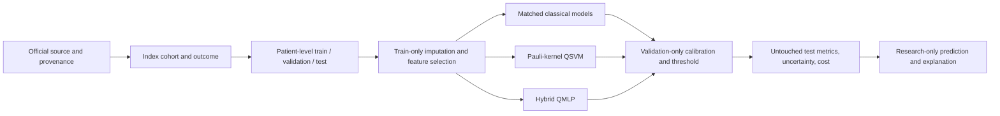

# Ischemic/coronary heart-disease QML experiment

**RESEARCH/EDUCATIONAL EXPERIMENT - NOT A MEDICAL DIAGNOSIS**

## Purpose and two different prediction questions

Ischemic heart disease occurs when coronary blood flow is insufficient for the heart muscle's
oxygen needs, usually because coronary arteries have narrowed or become blocked. Coronary heart
disease and coronary artery disease are often used for overlapping concepts. Angina, coronary
insufficiency, myocardial infarction, and fatal coronary heart disease can be relevant outcomes.
Those outcomes should not be silently mixed with congenital heart disease, valvular disease,
arrhythmia, myocarditis, or heart failure from unrelated causes.

This experiment deliberately separates two questions. Track A, **heart-disease presence
classification**, uses the public UCI Cleveland cohort. Its label records whether heart disease was
found during a diagnostic evaluation. It is not early prediction: clinical measurements and test
results are used to classify disease already represented by the outcome. Track B, **ten-year
incident coronary heart-disease risk prediction**, uses the longitudinal Framingham teaching data.
It starts from a participant without prevalent coronary disease and asks whether a first coronary
event occurs during a future ten-year window. A risk output is not a confirmed diagnosis, a
treatment recommendation, or a substitute for clinical examination, ECG, or angiography.

## UCI diagnostic cohort

The immediate functionality benchmark uses UCI Machine Learning Repository dataset 45, DOI
`10.24432/C52P4X`, accessed through the repository's `ucimlrepo` loader. The standard Cleveland
subset has 303 rows and thirteen predictors: age, sex, chest-pain type, resting blood pressure,
cholesterol, fasting-blood-sugar indicator, resting ECG result, maximum achieved heart rate,
exercise-induced angina, exercise ST depression, ST slope, major vessels visualized, and the
thallium-test category. The original `num` outcome is retained for auditing. `num == 0` means no
disease detected and values 1 through 4 mean disease present for the smoke binary target. `num`
never enters a predictor matrix.

Question marks are parsed as missing, especially in `ca` and `thal`. Rows are not discarded merely
because one input is absent. A deterministic, stratified 70/15/15 train/validation/test split is made
before fitting data-dependent operations. The final test partition remains untouched by feature
selection, model fitting, calibration, and threshold selection. Repeated development cross-validation
is specified for longer runs; the bounded smoke report is a single-seed proof of function and cannot
support a robust ranking.

The diagnostic outcome is broader than a fully adjudicated longitudinal ischemic endpoint. The
report therefore uses the source's exact heart-disease presence terminology. Optional severity or
multi-site analyses are outside smoke acceptance, and no UCI result is described as future risk.

## Framingham incident-risk cohort and censoring

The official NHLBI/BioLINCC longitudinal teaching dataset contains 4,434 participants, 11,627
examination rows, up to three clinic examinations about six years apart, and follow-up extending to
about 24 years. It is anonymized for instruction and explicitly unsuitable for publication-quality
research. The primary planned cohort selects `PERIOD == 1` and excludes `PREVCHD != 0`. A positive
has `ANYCHD == 1` with `TIMECHD <= 3652.5` days. A negative must have no coronary event inside the
horizon and documented observation through at least 3652.5 days. Someone without an event but with
shorter follow-up is censored or unknown and is excluded from the binary experiment rather than
being relabelled negative.

The secondary endpoint uses `MI_FCHD` and `TIMEMIFC` for hospitalized myocardial infarction or
fatal coronary heart disease. It is more specific but will have fewer events. An optional Period 2
landmark includes participants who attended Periods 1 and 2, remained free of prevalent disease at
Period 2, and have adequate future follow-up. It may construct first, current, absolute-change,
percentage-change, slope, and status-change features. Outcome time is measured relative to the
Period 2 examination. Period 3 values and measurements after an event are forbidden.

At implementation time the verified official teaching file was not locally present. The loader,
baseline endpoint construction, prevalence exclusion, censoring logic, and automated schema tests
are complete, but no Framingham sample count or performance is invented. Data-access instructions
state the expected path and provenance checks.

## From raw fields to model inputs

All fitted transformations operate within training data. The smoke pipeline median-imputes selected
original fields, standardizes them for classical and hybrid neural models, and separately maps them
to `[0, pi]` for quantum-kernel angles. The fitted imputer, both scalers, selected field order, and
model are saved. Validation, test, and prediction records use transformation only.

The resource-bounded reduced comparison keeps categorical source codes compact. This choice avoids
expanding a four-field quantum input into many one-hot columns but can impose artificial geometry on
nominal categories, especially chest-pain type. It is documented as an ablation, not a universally
preferred clinical representation. A practical full-feature classical comparison should one-hot
nominal fields with unknown-category handling. Reduced quantum claims are never compared to a
full-feature classical result without an input-mismatch label.

Feature selection is paper-inspired but leakage-safe. Logistic-regression recursive feature
elimination, random-forest importance, and mutual information are fitted on training rows. The
installed environment does not include a maintained mRMR dependency, so mutual information is the
explicit fallback. Each method ranks original fields; deterministic average rank produces the final
four, six, eight, or ten inputs. The ranking and fallback are saved. Longer studies should calculate
stability across folds and seeds. Any feature-selection benefit belongs equally to matched classical
controls.

## Classical models and fair comparisons

The model factory supports a dummy prior, logistic regression, linear and RBF SVM, k-nearest
neighbours, Gaussian naive Bayes, a decision tree, random forest, Extra Trees, histogram gradient
boosting, and a small classical MLP. Smoke mode trains logistic regression, both SVM forms, random
forest, and classical MLP. They receive identical selected fields, split, imputed values, and metric
definitions. Longer profiles can add the broader suite and a full-feature track.

Validation and test prevalence are never balanced. The costly quantum models may use a capped,
balanced subset selected only from training rows. Participant IDs and class counts are saved, and
matched classical subset controls are required for any stronger repeated-seed benchmark. No SMOTE
or other synthetic balancing occurs before splitting.

## Optimized quantum-kernel SVM

The paper-inspired optimized QSVM maps each selected feature to a qubit. The local exact feature map
uses Hadamard preparation, Pauli-Z rotations, and pairwise ZZ interactions, repeated twice in the
paper-like profile. The fidelity between two encoded states becomes a kernel entry, and scikit-learn
`SVC(kernel="precomputed")` fits the margin classifier. The project environment does not contain
Qiskit Machine Learning, so the maintained existing PennyLane path implements the equivalent
Pauli-style statevector idea. It is labelled accurately and is not called an exact Qiskit API
reproduction.

Only the upper triangle of the symmetric training kernel is evaluated, then mirrored. The runner
estimates `n(n+1)/2` training pairs plus validation and test pairs before execution and refuses costs
above the profile limit. Separate matrices, dimensions, execution counts, support-vector counts,
kernel-target alignment, circuit depth, and gate counts are saved. This makes cost visible: even an
exact four-qubit statevector can be dominated by quadratic pair evaluations.

## Hybrid quantum/classical MLP

The scientifically preferred HQMLP uses a small classical projection from selected standardized
fields to a bounded quantum latent vector, angle encoding, one to three trainable variational
layers, expectation values from each qubit, and a classical logit head. The preferred loss is
class-weighted binary cross entropy with logits. A paper-inspired ablation uses general `Rot`
(`U3`-equivalent) gates, CNOT entanglement, Adam near learning rate 0.01, and MSE on sigmoid output.
Pooling is not included in smoke because max-pooling a tabular vector depends on arbitrary feature
order. It remains a labelled optional paper ablation rather than an assumed improvement.

The implementation supports 4, 6, 8, and 10 qubits, linear or circular entanglement, and one to
three quantum layers. It records classical, quantum, and total trainable parameters; depth; one- and
two-qubit gates; forward circuit evaluations; gradient steps; optimizer steps; training and
inference time; and process memory. Early stopping watches validation loss and restores the best
epoch. Checkpoints are resumable artifacts in generated run directories and are excluded from Git.

## Calibration, thresholds, metrics, and explanations

SVM margins and raw quantum outputs are scores, not probabilities. Platt calibration is fitted only
on validation scores. Thresholds are also selected on validation data, using Youden J, maximum F1,
maximum F2, or a sensitivity-at-least-0.80 rule. Test probabilities and predictions are produced
once with those frozen choices. Small validation sets make calibration uncertain; Brier score and
expected calibration error are therefore reported without implying clinical reliability.

Every completed model records accuracy, balanced accuracy, AUROC, AUPRC, precision/PPV,
sensitivity, specificity, NPV, F1, F2, Matthews correlation coefficient, Brier score, ECE, threshold,
confusion matrix, runtime, memory, seed, and circuit/kernel work. Patient-level bootstrap intervals
are generated for AUROC, AUPRC, and Brier score. AUROC and AUPRC are read together, especially for
incident-risk imbalance. Overlapping intervals and a single smoke split prevent superiority claims.

Permutation importance describes classical model behaviour. The quantum models receive feature
ablation/local perturbation evidence, raw scores, support-vector information, kernel similarities,
and circuit expectations or parameter summaries where available. Explanations do not establish
clinical causality, and a nearby support vector is not called a clinically identical patient.

## Prediction interface, resource profiles, and interpretation

The JSON interface validates all thirteen UCI inputs, ranges, units where encoded, unknown fields,
and outcome-field rejection. It loads the fitted pipeline in saved feature order, emits an
uncalibrated model score and a calibrated probability, applies the frozen threshold, identifies the
model and run, and displays the research-only warning. Missing or out-of-range inputs fail clearly.

The safest 8 GB smoke uses four selected fields/qubits, one quantum layer, 50 balanced quantum
training rows, three QMLP epochs, cached exact kernels, 200 smoke bootstrap resamples, one seed, and
single-worker bounded execution. The laptop profile increases to six qubits, at most 100 quantum
training rows, two layers, three seeds, and 20 epochs only when memory headroom is available. The
24 GB profile explores up to ten qubits, 300 training rows, five seeds, and 60 epochs, but must still
estimate the quadratic kernel first.

The outcome of this work is a reproducible method and real bounded evidence, not a clinical tool.
Statevector simulation excludes hardware noise, queueing, sampling, error mitigation, and data-load
cost. Predictive quantum utility requires stable paired improvement over strong matched baselines
across seeds with uncertainty. Computational quantum advantage additionally requires credible
scaling and hardware evidence. Neither follows from one small UCI split, and negative results remain
scientifically useful.
